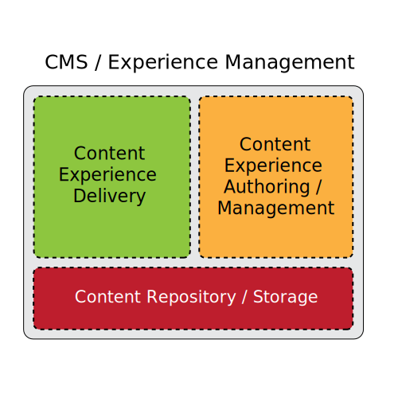
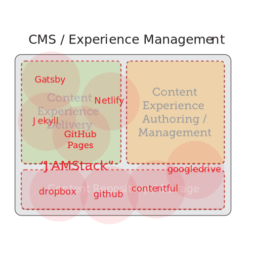

---

# Project Helix Update
q3 2019

---

# Zen
> Intelligent digital experience creation and delivery  for the next 20 years.

---

# AEM Technology

AEM's technology choices are 20 years old and served us well for the past 20 years

Java was very early, no cloud, no mobile

---

# Experience Management 

---

# Experience Management 

---

# New Players

---

# Vision

> Project Helix is AEM Sites X

---

# Plan

---

# Architecture

---

# Demo

---
